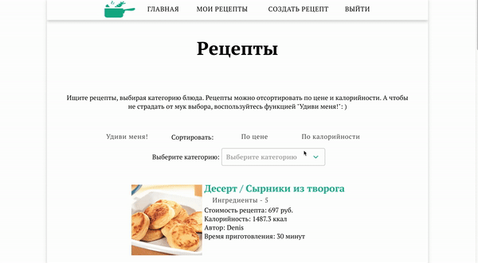

# Зеленые рецепты
Зеленые рецепты - сервис по созданию собственных рецептов на основе парсинга актуальных продуктов магазина ВкусВилл.
# Getting Started
В папках /front и  /back выполняем команду:
```
npm install
```
После чего отрываем директории /back и /front в разных окнах консоли и выполняем команду npm start в каждом из них.
```
npm start
```
# MVP
* Создание рецепта
* Подгрузка по запросу списка продуктов с сайта Вкусвилл в форме добавления рецепта
* Просмотр всех рецептов, сортировка и фильтрация 
* Редактирование рецепта
* Удаление рецепта
* Авторизация



# Authors
<ul>
<li><a href="https://github.com/ArtVolchara">Артём Волков</a></li>
<li><a href="https://github.com/debbes">Денис Красавин</a></li>
 <li><a href="https://github.com/beshunmo">Денис Лемишевский</a></li>
<li><a href="https://github.com/mitrafantos">Дмитрий Троицкий</a></li>
</ul>

# Next Steps
* Добавить лайки
* Добавить избранные рецепты
* Добавить генерацию списка покупок
